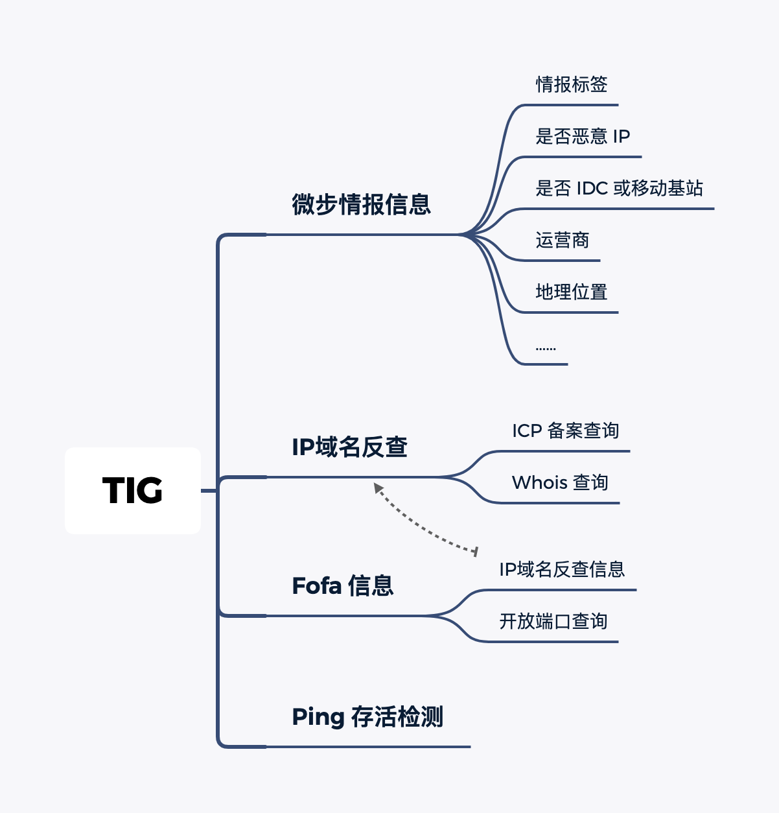
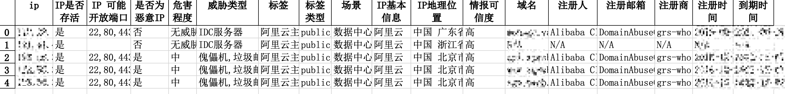

<h1 align="center">TIG  威胁情报收集 🪓</h1>


# 0x00 介绍

## 解决问题

TIG `Threat Intelligence Gathering` ，即威胁情报收集。

在蓝队进行溯源工作时，通常有以下场景：

1. 需要对 IP 的威胁情报信息、域名反查备案、IP 存活等信息进行查询

2. 需要对多个攻击 IP 进行查询

为了提高蓝队在进行这项工作时的效率，为此简单编写了一个威胁情报收集的小工具。


求 Star ⭐️ ~~~~


## 工具介绍

**工具代码完全开源，放心使用，XDM 有问题可以在 GitHub 提 issue 或者关注底部公众号加入团队官方交流群~**

**我们也会根据大家反馈的内容持续完善！**


当前该工具获取 IP 的信息有以下几个角度：

1. 微步情报信息：获取到 IP 的标签信息、是否恶意 IP、地理位置等等

2. IP 域名反查：获取到 IP 对应的域名，从而根据域名查询到备案信息和 Whois 信息

3. Fofa 信息：获取到 IP 可能开放的端口和 IP 对应的域名信息

4. Ping 存活检测：判断 IP 是否存活

假设在获取到的信息最大化情况下，通过 TIG 可以一键发现 IP 对应的情报标签、域名、域名注册人、备案邮箱、备案号、备案单位、域名注册商、IP 开放端口、地理位置等等信息。



后续将集成更多模块，如有好的建议或遇到 Bug 欢迎提 issue

# 0x01 安装

需要 python3.6 或更高版本支持

```
git clone https://github.com/wgpsec/tig.git
cd  tig
pip3 install -r requirements.txt
python3 tig.py
```

# 0x02 使用

## 帮助信息

UNIX 安装指南：

```bash
cd /opt/
git clone https://github.com/wgpsec/tig.git
echo '#!/bin/bash
cd /opt/tig
python3 tig.py $@' > /usr/bin/tig
chmod +x /usr/bin/tig
tig -v
```

工具命令如下：

```
 -h, --help  show this help message and exit
 -c CONFIG   指定配置文件，默认 ./config.ini
 -f FILE     指定 IP 文本，一行一个
 -i IP       指定目标 IP
 -p PROXY    指定代理，比如：http://127.0.0.1:1080 或者 socks5://127.0.0.1:1080
 -o OUTPUT   导出为 excel 表格，例如 output.xlsx
```

## 配置文件

如果是第一次使用本工具，在启动时会提示输入您的微步 API 和 Fofa API


查看自己微步 API  Key 的地址为：[https://x.threatbook.cn/nodev4/vb4/myAPI](https://x.threatbook.cn/nodev4/vb4/myAPI)，免费账户有每天 50 次的限额。

查看自己 Fofa API Key 的地址为：[https://fofa.info/personalData](https://fofa.info/personalData)，普通会员每次免费前 100 条，高级会员每次免费前 10000 条。

如果之前使用过历史版本，程序会自动根据原来的配置文件生成当前的配置文件，无需手动更改。


## 示例

例如这里要获取某个 IP 的信息，直接使用 -i 命令即可，结果会默认保存到 output 文件夹内，或者 -o 指定导出文件位置。

```bash
 python3 runner.py -i IP -o fileURL
 python3 runner.py -i IP -o ./output
```

或者直接指定一个 IP 列表，结果导出到 result.xlsx 文件里。

```bash
 python3 runner.py -f IP.txt -o result.xlsx
```

导出表格文件信息如下



